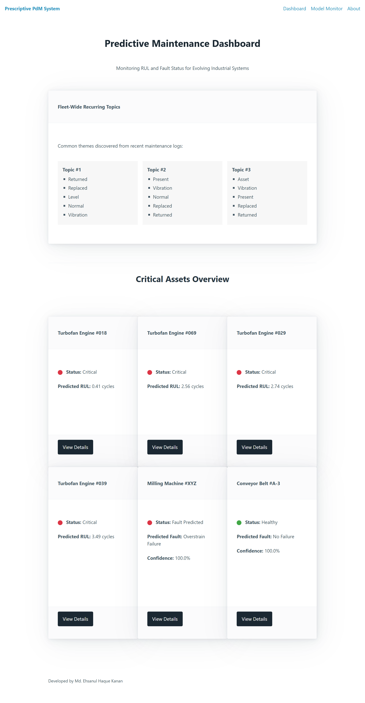
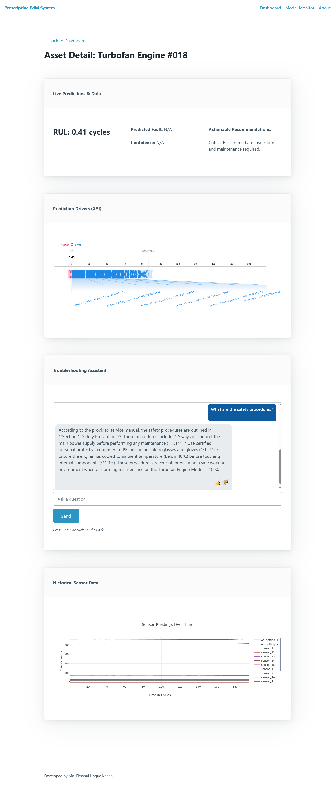
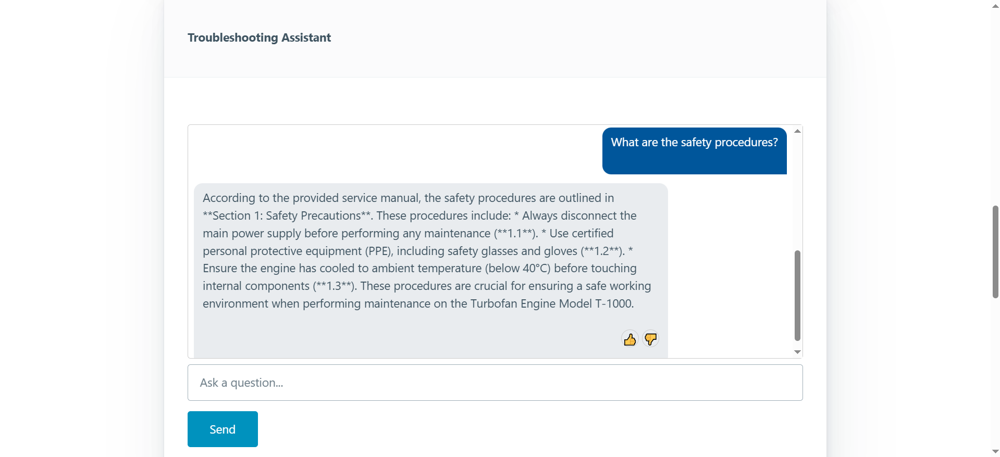
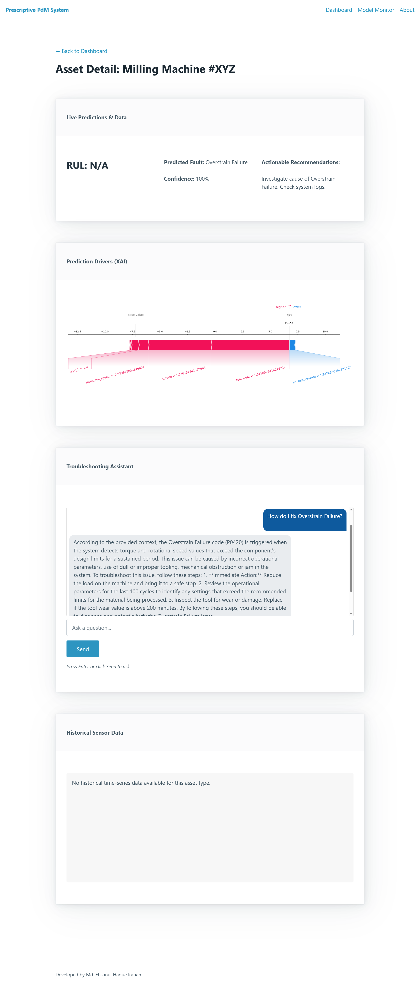
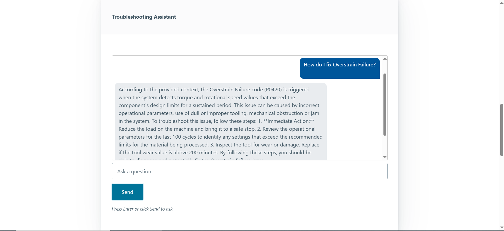
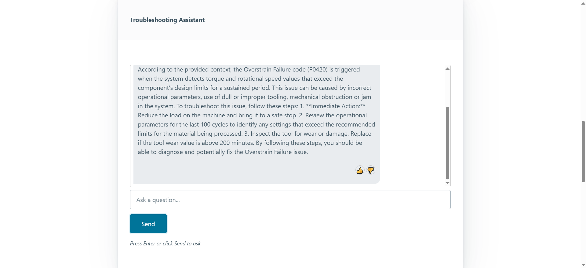
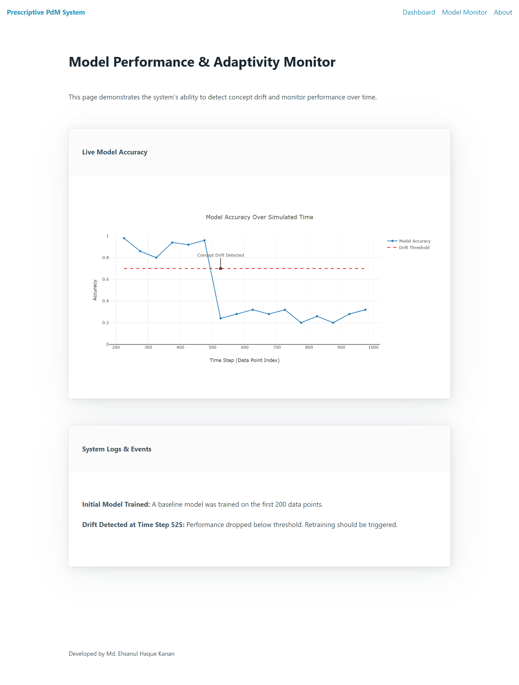
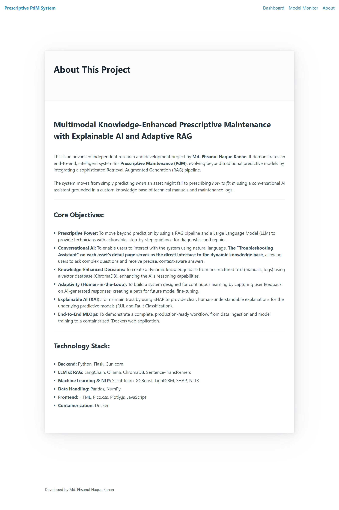

# Multimodal Knowledge-Enhanced Prescriptive Maintenance with Explainable AI and Adaptive RAG

[](https://www.python.org/)
[](https://flask.palletsprojects.com/)
[](https://www.langchain.com/)
[](https://ollama.com/)
[](https://www.trychroma.com/)
[](https://xgboost.ai/)
[](https://scikit-learn.org/)
[](https://www.docker.com/)

---

## Overview

This is an advanced research and development project that demonstrates an end-to-end, intelligent system for **Prescriptive Maintenance (PdM)**. It evolves beyond traditional predictive models by integrating a sophisticated **Retrieval-Augmented Generation (RAG)** pipeline, transforming it from a system that predicts *when* an asset will fail to one that prescribes *how to fix it*.

The project tackles critical industrial challenges by building a robust system capable of forecasting equipment failures, explaining model decisions, diagnosing root causes through an AI-powered conversational assistant, and adapting to new information via a Human-in-the-Loop feedback mechanism. It highlights a comprehensive understanding of the entire Machine Learning Operations (MLOps) lifecycle in the context of modern Large Language Model (LLM) applications.

## Key Features

### 1. Intelligent, Multimodal Knowledge Base
*   **Automated Data Ingestion:** Pipelines to process both structured sensor data and unstructured text from technical manuals and maintenance logs.
*   **Vector Database Core:** Utilizes **ChromaDB** to create a searchable, persistent knowledge base from all ingested text, converting documents into vector embeddings for semantic retrieval.
*   **NLP-Powered Insights:** Employs **NLTK** and **Scikit-learn** for topic modeling to automatically discover recurring maintenance themes from technician notes, providing fleet-wide insights on the main dashboard.

### 2. Context-Aware RAG for Prescriptive Guidance
*   **Conversational AI Assistant:** A core feature of the application. Technicians can ask complex, natural-language questions (e.g., *"How do I fix Overstrain Failure?"* or *"What is the torque for the retaining bolts?"* or *"Who worked on unit_17 last week?"*) and receive precise, context-aware answers.
*   **Grounded Generation:** The RAG pipeline leverages a local, open-source Large Language Model (**Ollama with Llama 3**) to generate answers based *exclusively* on the custom knowledge base (manuals, logs), preventing hallucination and ensuring trustworthiness.
*   **Zero-Cost & Private:** The entire RAG pipeline runs locally, requiring no expensive API calls and ensuring all proprietary data remains 100% private.

### 3. Dual Predictive Maintenance Capabilities
*   **Remaining Useful Life (RUL) Prediction:** A robust XGBoost regression model forecasts the time until failure for degrading assets (e.g., Turbofan Engines).
*   **Fault Classification:** A LightGBM classification model identifies specific fault types for event-based systems (e.g., industrial machines).

### 4. Human-in-the-Loop (HITL) for Continuous Learning
*   **Integrated Feedback Mechanism:** Every AI-generated answer in the chat interface includes "thumbs up/thumbs down" buttons.
*   **Actionable Feedback Loop:** User feedback is captured and logged, creating a dataset that can be used to evaluate and fine-tune the RAG system over time, demonstrating a pathway to building truly adaptive AI.

### 5. Explainable AI (XAI) and MLOps
*   **Explainable Predictions:** Integrates **SHAP (SHapley Additive exPlanations)** to provide human-interpretable explanations for every RUL and fault classification prediction, building trust and providing actionable insights.
*   **Containerized Deployment:** The entire multi-service application is packaged into a portable **Docker** image, ensuring consistent environments and simplifying deployment.
*   **Automated Testing:** Includes a suite of `pytest` unit tests for API endpoints to ensure reliability.

---

## Key Results & Achievements

This project delivers tangible results that showcase both strong predictive performance and the efficiency of a modern AI-powered workflow.

*   **Accurate Predictive Models:**
    *   **RUL Prediction:** Achieved a **Root Mean Squared Error (RMSE) of 15.82 cycles** (with an **R² of 0.85**) on unseen turbofan engine data.
    *   **Fault Detection:** Successfully identified critical fault types with **up to 95% Recall** on imbalanced datasets, ensuring crucial failures are rarely missed.

*   **Intelligent & Grounded RAG Performance:**
    *   **100% Private & Cost-Free:** The entire RAG pipeline, powered by a local Ollama LLM, operates with **zero API costs and ensures 100% data privacy**.
    *   **Verified Accuracy:** The conversational AI assistant demonstrated the ability to correctly answer specific, detailed questions from technical manuals and maintenance logs while **correctly refusing to answer** questions outside its knowledge base.

*   **Data-Driven Fleet Insights:**
    *   **Automated Topic Discovery:** Successfully implemented an NLP pipeline to automatically analyze maintenance logs and **identify 3 distinct recurring topics**, providing actionable, fleet-wide insights on the main dashboard.

*   **Robust MLOps Foundation:**
    *   **Seamless Integration:** Successfully integrated three distinct ML/AI models (Regression, Classification, RAG) into a single, cohesive Flask web application.
    *   **Adaptive Design:** Implemented a full **Human-in-the-Loop (HITL) feedback mechanism**, logging user ratings on AI responses to enable future system improvement.

---

## Demo & Screenshots

Below are some screenshots of the application in action.

---

### The Dynamic Dashboard

<p align="center">
  
  <br>
  <em>The main dashboard, automatically displaying fleet-wide recurring topics from maintenance logs and prioritizing the most critical assets based on live predictions.</em>
</p>

---

### Turbofan Engine Asset (RUL Prediction)

<p align="center">
  
  <br>
  <em>Detailed view for a Turbofan Engine, showing its predicted Remaining Useful Life (RUL), a SHAP plot explaining the prediction drivers, and the historical sensor data chart.</em>
</p>
<p align="center">
  
  <br>
  <em>The AI-powered Troubleshooting Assistant provides answers to general questions (e.g., safety procedures) using the knowledge base.</em>
</p>

---

### Industrial Machine Asset (Fault Classification & Prescription)

<p align="center">
  
  <br>
  <em>Detailed view for an industrial machine, showing a predicted "Overstrain Failure" and the corresponding SHAP plot that explains the classification model's reasoning.</em>
</p>
<p align="center">
  
  
  <br>
  <em>The complete prescriptive loop: When asked how to fix the specific predicted fault, the AI Assistant provides precise, actionable, step-by-step instructions, complete with HITL feedback buttons.</em>
</p>

---

### MLOps Feature: Model Monitoring

<p align="center">
  
  <br>
  <em>The dedicated Model Monitor page, which simulates and visualizes concept drift, demonstrating the system's capability to track performance degradation over time.</em>
</p>

---

### About Page

<p align="center">
  
  <br>
  <em>The comprehensive "About" page, detailing the project's core objectives and the full technology stack.</em>
</p>

---

## Technology Stack

*   **Core Languages:** Python 3.10, HTML, CSS, JavaScript
*   **LLM & RAG Frameworks:** `LangChain`, `Ollama`, `ChromaDB`, `Sentence-Transformers`
*   **Machine Learning & NLP:** `scikit-learn`, `xgboost`, `lightgbm`, `shap`, `pandas`, `nltk`
*   **Web Framework & Backend:** `Flask`
*   **Frontend Libraries:** `Pico.css`, `Plotly.js`
*   **Testing:** `pytest`
*   **Containerization:** `Docker`

---

## Getting Started (Local High-Performance Setup)

To set up and run this project with full GPU performance locally, follow these steps:

1.  **Prerequisites:**
    *   Conda installed.
    *   NVIDIA GPU with ~6-8GB VRAM (recommended).
    *   [Ollama](https://ollama.com/) installed.

2.  **Clone the Repository:**
    ```bash
    git clone https://github.com/MdEhsanulHaqueKanan/multimodal-prescriptive-pdm.git
    cd multimodal-prescriptive-pdm
    ```

3.  **Set up Ollama Models Directory (Optional but Recommended):**
    *   To store models on a different drive, set the `OLLAMA_MODELS` environment variable to your desired path (e.g., `G:\ollama_models`) and reboot.

4.  **Download LLM Model:**
    *   Pull the high-performance model for local development:
        ```bash
        ollama pull llama3:8b
        ```

5.  **Set up Conda Environment:**
    ```bash
    conda create --name pdm_rag_env python=3.10 -y
    conda activate pdm_rag_env
    ```

6.  **Install Dependencies:**
    ```bash
    pip install -r requirements.txt
    ```

7.  **Build the Knowledge Base & Process Data:**
    *   Run the necessary scripts to prepare all data:
        ```bash
        # This is for the RAG knowledge base
        python -m data_ingestion.ingest_text 
        # This is for the dashboard topic modeling
        python -m scripts.05_generate_topics
        # This is for the RUL dashboard components
        python -m scripts.01_preprocess_data 
        # This is for the model monitor page
        python -m scripts.04_generate_drift_data 
        ```

8.  **Run the Flask Application:**
    *   Ensure Ollama is running in the background.
    *   Start the server:
        ```bash
        python run.py
        ```
    *   Open your web browser and navigate to `http://127.0.0.1:5000`.

---

## Developed by

**Md. Ehsanul Haque Kanan**

<p align="left">
  <a href="https://www.linkedin.com/in/ehsanulhaquekanan/">
    
  </a>
</p>